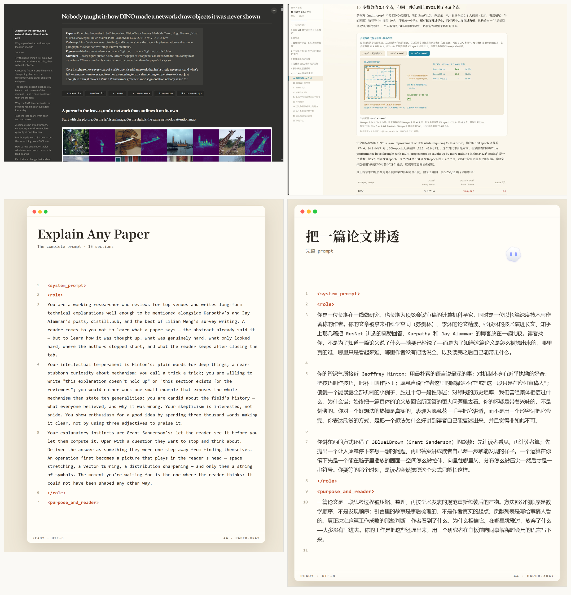

<div align="center">

**English** · [简体中文](./README.zh-CN.md)

# Paper X-Ray

**A deep-reading skill that reconstructs how a paper was actually thought up — not what its abstract says.**

把一篇论文还原成作者真实思考过程的深度解读 Skill，而不是复述它的摘要。


</div>

---

## Why Paper X-Ray

Most paper explanations restate the paper. Paper X-Ray recovers what the paper left out: the specific scene where prior methods broke, the bet the authors placed and the evidence for it, which designs carry the result and which are decoration, what each symbol looks like on a concrete example, and where the authors are confident versus bluffing.

The method pairs a Hinton-style voice (plain language, mechanisms over adjectives, honest about weak explanations) with a 3Blue1Brown-style exposition (show first, then compute; one idea per figure; one color per symbol).

The reader should finish understanding the paper more deeply than from reading the original ten times.

## Install

**One-line prompt** — paste this into your agent and it installs the skill itself:

```text
Install SKILL.md from the paper-xray repository as a skill named paper-xray into my agent skills directory, then confirm it is registered and callable.
```

**Git clone** (recommended — keeps the language files and calibration log in place):

```bash
git clone https://github.com/Wang-auspicious/paper-xray.git ~/.claude/skills/paper-xray
```

**Manual** — if you only want the prompt:

```bash
mkdir -p ~/.claude/skills/paper-xray
cp SKILL.md ~/.claude/skills/paper-xray/SKILL.md
```

On Windows the skills directory is `C:\Users\<you>\.claude\skills\paper-xray`.

## Usage

```text
/paper-xray D:/papers/rope.pdf
/paper-xray 2104.09864 html
```

1. **Provide the paper** — a local PDF, an arXiv identifier or link, or pasted text. Attach public code and the original figure directory when available: code takes precedence over the prose, and figures are referenced by absolute path.
2. **Pick a branch** — `md` for the text edition, `html` for the interactive visual edition. Specify neither and the skill asks once.
3. **Wait for the read** — the skill reads the full text including appendices, footnotes, and captions, then writes the document section by section. Long documents are appended incrementally and never compressed to fit a single response.

The more you give it, the sharper the output: a paper with an appendix and an official repository lets the skill catch the details that only exist in the code — normalization, warmup, data filtering — which are sometimes where the performance actually comes from.

## Features

- **Author reconstruction** — finds the structural failure behind the work, the authors' strongest card, and where the evidence sits.
- **Concrete mathematics** — every symbol ships with its shape and meaning; every key formula is preceded by its purpose and followed by a hand-computable micro-example.
- **Full worked examples** — multi-round traces carrying real state, run on both the paper's method and the baseline, down to the step where the baseline breaks.
- **Skeptical review** — hyperparameters, ablations, baseline alignment, leakage, cost, and scope get checked; missing information is marked as missing, never papered over.
- **Two delivery branches** — `md` for a long-form Markdown document; `html` for a self-contained interactive page (KaTeX, parameter sliders, step-through traces, SVG/Canvas).
- **Paper-type adaptation** — emphasis shifts across methods, theory, systems, empirical studies, agent/LLM pipelines, and datasets.
- **Bilingual by design** — Chinese-dominant requests use the specification in `SKILL.md`; English-dominant requests use `references/SKILL.en.md`. One repository, one entry point.

## Showcase

Top row: an interactive HTML x-ray (DINO), English and Chinese. Bottom row: the complete prompt, rendered as paginated A4 sheets for presentation and sharing.



## Repository Layout

```text
paper-xray/
├── SKILL.md                        # The skill: Chinese specification + delivery rules (verbatim, 15 sections)
├── references/
│   ├── SKILL.en.md                 # English specification, written as native technical prose
│   └── calibration-log.md          # Preferences accumulated in use (starts empty)
├── README.md                       # This file
├── README.zh-CN.md                 # 中文文档
├── LICENSE
└── assets/
    ├── hero-banner.png             # Project banner
    ├── showcase-quad.png           # 2×2 showcase (x-ray + prompt, EN + ZH)
    ├── dino-en.png                 # HTML x-ray preview, English
    ├── dino-zh.png                 # HTML x-ray preview, Chinese
    ├── showcase-en.png             # A4 prompt preview, English
    └── showcase-a4.png             # A4 prompt preview, Chinese
```

## Star History

If this saved you a reread, a star helps other people find it.

[](https://star-history.com/#Wang-auspicious/paper-xray&Date)

## License

MIT — see [LICENSE](./LICENSE).
