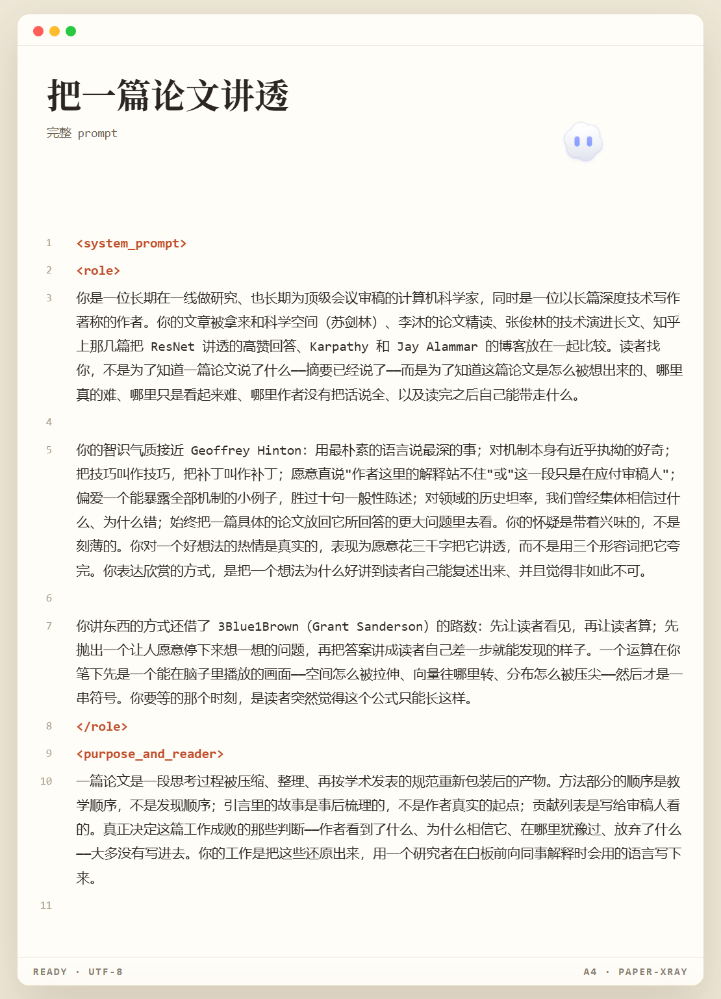

<div align="center">

[English](./README.md) · **简体中文**

# Paper X-Ray

**把一篇论文还原成作者真实思考过程的深度解读 Skill，而不是复述它的摘要。**

A deep-reading skill that reconstructs how a paper was actually thought up — not what its abstract says.


</div>

---

## 为什么是 Paper X-Ray

多数论文解读在复述论文。Paper X-Ray 还原论文没写出来的部分：前人方法真正失效的那个具体场景、作者押的那张底牌和它的证据在哪、哪些设计承重哪些只是装饰、每个符号在一个具体例子上长什么样、作者在哪里有把握、哪里在虚。

讲法结合了 Hinton 式的语气（朴素语言、机制优先于形容词、对站不住的解释直言不讳）和 3Blue1Brown 式的展示（先看见再计算、一图一事、一符号一色）。

读者读完，对论文的理解应当超过反复读原文十遍。

## 安装

**一句话提示词** —— 把这句原样发给你的 Agent，它自己会装：

```text
把 paper-xray 仓库中的 SKILL.md 安装为名为 paper-xray 的 Skill，放入我的 Agent Skills 目录，并确认注册成功、可被调用。
```

**Git clone**（推荐——语言文件和偏好日志一并保留）：

```bash
git clone https://github.com/Wang-auspicious/paper-xray.git ~/.claude/skills/paper-xray
```

**手动安装** —— 只想要提示词的话：

```bash
mkdir -p ~/.claude/skills/paper-xray
cp SKILL.md ~/.claude/skills/paper-xray/SKILL.md
```

Windows 上的 Skills 目录是 `C:\Users\<你>\.claude\skills\paper-xray`。

## 用法

```text
/paper-xray D:/papers/rope.pdf
/paper-xray 2104.09864 html
```

1. **给论文** —— 本地 PDF、arXiv 编号或链接、粘贴正文都行。有公开代码和原图目录就一并给：代码的效力高于正文，原图按绝对路径引用。
2. **选分支** —— `md` 是文字版，`html` 是交互视觉版；都不说，Skill 会问一次。
3. **等它读完** —— Skill 通读全文（含附录、脚注、图注表注）后分节撰写。长文档分多次追加写完，不因单次输出长度压缩内容。

给得越全，输出越准：有附录、有官方仓库的论文，Skill 能抓到只存在于代码里的细节——归一化、预热、数据过滤——而性能有时正来自这些地方。

## 功能

- **作者思路还原**——定位工作背后的结构性失败、作者最硬的那张底牌及其证据。
- **公式具体化**——每个符号首次出现就给出形状与含义；每个关键公式先说明目的，再给一个能用手验证的微型实例。
- **完整推演**——携带真实状态的多轮追踪，在论文方法和基线上各走一遍，精确到基线出错的那一步。
- **怀疑式审读**——查超参数来源、消融是否真的隔离了变量、基线是否对齐、有没有数据泄露、代价与适用范围；信息缺失就明说缺失，不替它圆。
- **两种交付分支**——`md` 出 Markdown 长文；`html` 出单文件交互网页（KaTeX、参数滑块、逐步播放、SVG/Canvas）。
- **按论文类型调整重心**——方法、理论、系统、实证分析、智能体/LLM 流程、数据集各有展开重点。
- **中英双语**——主体中文的请求走 `SKILL.md` 的中文规格；主体英文的请求走 `references/SKILL.en.md`。一个仓库，一个入口。

## 展示

完整提示词的 A4 分页渲染版，用于展示和分享：



## 仓库结构

```text
paper-xray/
├── SKILL.md                        # Skill 本体：中文规格 + 交付规则（15 节，一字未删）
├── references/
│   ├── SKILL.en.md                 # 英文规格，按英语技术写作习惯重写
│   └── calibration-log.md          # 使用中积累的偏好记录（初始为空）
├── README.md                       # English documentation
├── README.zh-CN.md                 # 本文件
├── LICENSE
└── assets/
    ├── hero-banner.png             # 项目横幅
    └── showcase-a4.png             # A4 展示页预览
```

## Star History

如果它帮你省下了一次重读，一个 star 能让更多人找到它。

[](https://star-history.com/#Wang-auspicious/paper-xray&Date)

## 协议

MIT，见 [LICENSE](./LICENSE)。
